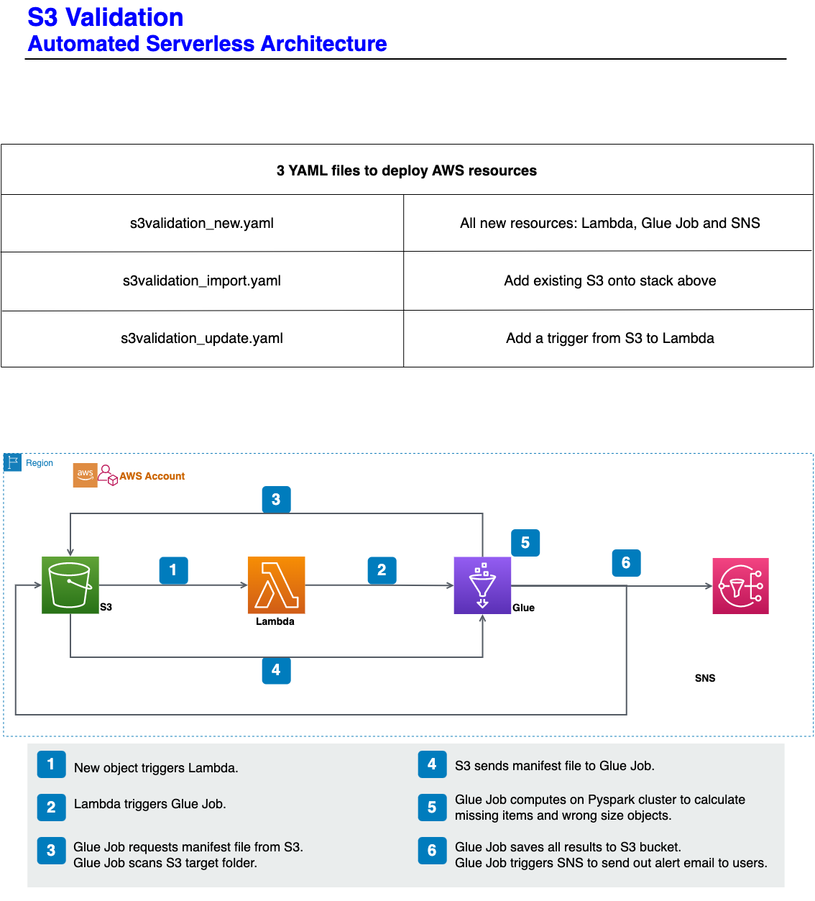

___
## What is S3 to S3 Validation:
This is a processing validation. When someone needs to check they have gotten required objects with correct size in Target S3 bucket under a specific folder, a .csv file needs to provided for this validation.
### Required .csv file:
This version mainly support .csv in format: no header, 4 columns, 
1st column: Site
2nd column: Accessment
3rd column: Path
4th column: Size
Columns of **Path** and **Size** will be used for validation in one dataframe
### Two results dataframe:
**missing_df** -> values in this dataframe exist in provided file, but not in target S3 bucket's folder.
**wrong_size_df** -> values in this dataframe exist in both file and target S3 bucket's folder, but file size is inconsistent.

___
## Diagram:

___
## How to use S3 to S3 Validation:
1. Deploy resources in the same account in the same region in AWS by create CloudFormation stacks using three yaml files below in order.
1.1 **s3validation_new.yaml** -> upload and generate stack for Glue Job (function), Lambda (as a trigger from S3) and SNS (for notification).
1.2 **s3validation_import.yaml** -> import existing Target S3 bucket into stack above.
1.3 **s3validation_update.yaml** -> update stack above by adding the trigger from S3 to Lambda.
2. Upload **s3_to_s3_validation_script.py** to Target folder under Target S3 bucket.
4. Upload **s3_to_s3_validation.csv** into trigger folder to start validation.
### Validation Result 
The results will be saved in S3 at this path: <TargetS3>/s3_to_s3_validation_result_<TargetS3_TargetFolder>/<results>.
Alert emails will be sent to subscribers of SNS.
___
## Steps in validation Python code:

1. Setup basic arguements for s3 to s3 validation
2. Get initial arguements from Glue Job sys and other helper functions
3. Read file into PySpark dataframe
4. Scan the objects' name and size under the target folder in the target bucket to generate another PySpark dataframe
5. remove validation script from PySpark dataframe
6. Prepare and do comparisons on two dataframes
7. Save validation result to Target S3 with the same level as the Target folder
8. Send out notification to SNS subscribers

Please comment from awsglue.utils import getResolvedOptions and from awsglue.context import GlueContext,
if using pytest with this file
___
## Future work:
1. File template will be more generic, not only for DISH Drone team
2. Currenly executing by AWS console, AWS CLI should be doable in order to generate work flow automatically
3. Need to explore cross accounts execution
4. Place code in GitHub and fetch by an initial trigger automatically from AWS, if cross accounts is realized
5. Be packed up as a module, so this can be imported by other developers if possible
___
