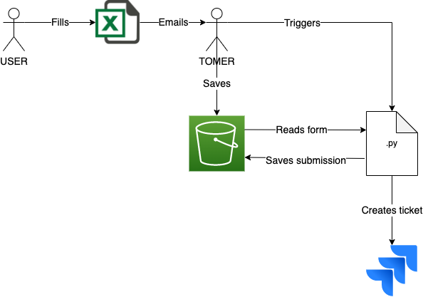

## Data Platform Form Intake - Version 1

This form is to be filled by a developer who has an idea for a data product. This information will be used to populate a Jira ticket which will be assigned to the appropriate team to fulfill the request.

Below is the diagram for version 1. This version is in its simplest form, setting up the functionality that will be fully automated in the future. 





1. Tomer sends a user the template.
2. User fills out the template and emails it back to Tomer.
3. Tomer saves the filled form onto an s3 bucket.
4. Tomer manually triggers the python program.
5. The program will process the form and extract from it the information that will populate the Jira ticket.
6. The program will save the user submission and additions as JSON files in the s3 bucket.
7. The program will create a Jira ticket and populate it with the submission information.

**Data Location**
- account: aws-5g.dp.mss.data-science.dev
- bucket: dp-intake-form
    - 'dpi_form_template.xlsx'
    - filled_forms/
        - This is where filled forms are saved.
    - submissions/
        - This is where the user submission gets saved in JSON format.
    - additions/
        - This is where the user additions get saved in JSON format.

To run:

```
python dp_form_intake.py
```