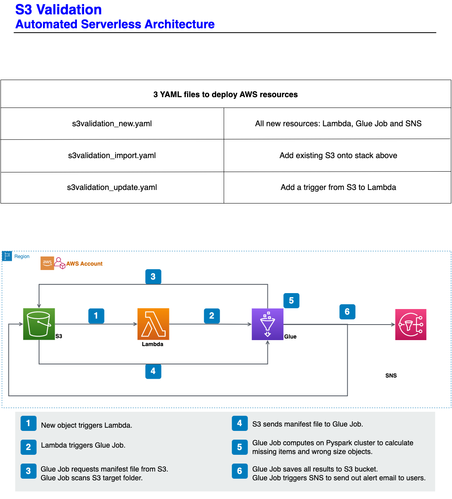

___
# What is S3 to S3 Validation:
## This is a processing validation. When someone needs to check they have gotten required objects with correct size in Target S3 bucket under a specific folder, a .csv file needs to provided for this validation.
## This version mainly support .csv in format provided by DISH Drone team: no header, 4 columns, 
1st column: Site
2nd column: Accessment
3rd column: Path
4th column: Size
## 3rd and 4th columns will be used for validation in one dataframe
## Actual values for objects on Path, Size and Date under Target folder in Target S3 bucket will be used for validation in another PySpark dataframe
## Two results dataframe:
missing_df -> values in this dataframe exist in provided file, but not in target S3 bucket's folder.
wrong_size_df -> values in this dataframe exist in both file and target S3 bucket's folder, but file size is inconsistent.

___
# Diagram:

___
# How to use S3 to S3 Validation:
## Deploy resources in the same account in the same region in AWS by create CloudFormation stacks using three yaml files below.
s3validation_new.yaml -> upload and generate stack for Glue Job (function), Lambda (as a trigger from S3) and SNS (for notification)
s3validation_import.yaml -> import existing Target S3 bucket into stack above
s3validation_update.yaml -> update stack above by adding the trigger from S3 to Lambda
## Upload s3_to_s3_validation_script.py to Target folder under Target S3 bucket
## The provided file should be uploaded to trigger folder with Target S3 bucket to start the validation
## This file's name must be s3_to_s3_validation.csv (s3_to_s3_validation.csv in this folder is an example template)
## The results will be saved in S3 at this path: <TargetS3>/s3_to_s3_validation_result_<TargetS3_TargetFolder>/<results>
## Alert emails will be sent to subscribers of SNS (Target S3 name without symbol of dot, e.g.: '.')

___
# Steps in validation Python code:

1. Setup basic arguements for s3 to s3 validation
2. Get initial arguements from Glue Job sys and other helper functions
3. Read file into PySpark dataframe
4. Scan the objects' name and size under the target folder in the target bucket to generate another PySpark dataframe
5. remove validation script from PySpark dataframe
6. Prepare and do comparisons on two dataframes
7. Save validation result to Target S3 with the same level as the Target folder
8. Send out notification to SNS subscribers

Please comment from awsglue.utils import getResolvedOptions and from awsglue.context import GlueContext,
if using pytest with this file
___
# Future work:
1. File template will be more generic, not only for DISH Drone team
2. Currenly executing by AWS console, AWS CLI should be doable in order to generate work flow automatically
3. Need to explore cross accounts execution
4. Place code in GitHub and fetch by an initial trigger automatically from AWS, if cross accounts is realized
5. Be packed up as a module, so this can be imported by other developers if possible

___
# Pylint and Pytest results:
## Pylint:
************* Module s3_to_s3_validation_script
s3_s3_validation/s3_to_s3_validation_script.py:11:0: E0401: Unable to import 'awsglue.utils' (import-error)
s3_s3_validation/s3_to_s3_validation_script.py:12:0: E0401: Unable to import 'awsglue.context' (import-error)
s3_s3_validation/s3_to_s3_validation_script.py:448:0: R0913: Too many arguments (7/5) (too-many-arguments)
s3_s3_validation/s3_to_s3_validation_script.py:518:0: R0913: Too many arguments (7/5) (too-many-arguments)
s3_s3_validation/s3_to_s3_validation_script.py:546:0: R0914: Too many local variables (36/15) (too-many-locals)

------------------------------------------------------------------
Your code has been rated at 9.50/10 (previous run: 9.46/10, +0.04)

## Pytest:
(venv) sagemaker-user@studio$ pytest test_s3_to_s3_validation_script.py --verbose
================================== test session starts ===================================
platform linux -- Python 3.9.15, pytest-7.2.1, pluggy-1.0.0 -- /home/sagemaker-user/git/skynet/venv/bin/python
cachedir: .pytest_cache
rootdir: /home/sagemaker-user/git/skynet
collected 17 items                                                                       

test_s3_to_s3_validation_script.py::test_get_current_denver_time PASSED            [  5%]
test_s3_to_s3_validation_script.py::test_generate_result_location PASSED           [ 11%]
test_s3_to_s3_validation_script.py::test_initial_boto3_client PASSED               [ 17%]
test_s3_to_s3_validation_script.py::test_initial_boto3_resource PASSED             [ 23%]
test_s3_to_s3_validation_script.py::test_get_sns_name PASSED                       [ 29%]
test_s3_to_s3_validation_script.py::test_get_sns_arn PASSED                        [ 35%]
test_s3_to_s3_validation_script.py::test_rename_columns PASSED                     [ 41%]
test_s3_to_s3_validation_script.py::test_file_to_pyspark_df PASSED                 [ 47%]
test_s3_to_s3_validation_script.py::test_list_to_pyspark_df PASSED                 [ 52%]
test_s3_to_s3_validation_script.py::test_s3_obj_to_pyspark_df PASSED               [ 58%]
test_s3_to_s3_validation_script.py::test_get_script_prefix PASSED                  [ 64%]
test_s3_to_s3_validation_script.py::test_remove_script_from_df PASSED              [ 70%]
test_s3_to_s3_validation_script.py::test_get_missing_objects PASSED                [ 76%]
test_s3_to_s3_validation_script.py::test_get_df_count PASSED                       [ 82%]
test_s3_to_s3_validation_script.py::test_get_match_objects PASSED                  [ 88%]
test_s3_to_s3_validation_script.py::test_get_wrong_size_objects PASSED             [ 94%]
test_s3_to_s3_validation_script.py::test_save_result PASSED                        [100%]
___
